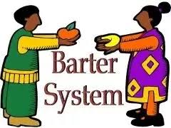

# AMANA
## A de-centralized platform for entreprenuers.
### Breaking the barriers.

1. With the advent of technology the world has changed to a global village.
2. Humans every where have the same basic requirements to survive, why can't we have a universal currency system that we can use to exchange services?
3. We believe that this is what we can provide users with AMANA.
4. With our platform people can make use of each others ability with the exchange of a currency that knows no boundries "Cryptocurrency", and for this purpose we would make use of stable coin to equip users to over come the harsh boudries of inter-country regulations surrounding fiat transfer.
5. We aim to proceed with the basic features of blockchain, i.e : 
    1. Anonimity.
    2. Trust.
    3. Transparency.
    4. De-Centralization.
6. Having presented with the basic idea behind our product, here is a 3 step transformation of exchange between humans:
    1. Exchange of goods with goods of equal value.
    
    2. The take over of fiat.
    
    3. Taking a leap forward with digitalization.
    
    